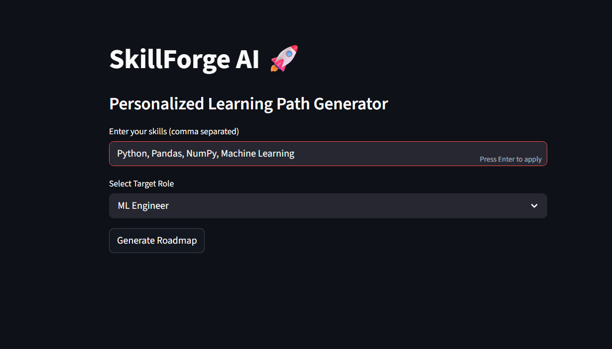
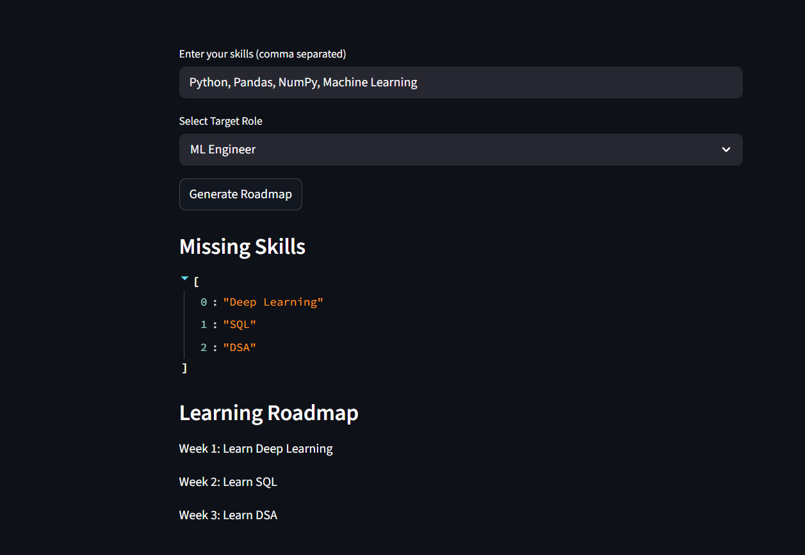

# SkillForge AI 🚀

AI-powered personalized learning path generator.

## Features
- Skill gap detection system
- Personalized roadmap generation
- Role-based learning recommendations
- Streamlit interactive UI

## Tech Stack
Python, Streamlit, Pandas, Scikit-learn

## Project Idea
Acts as an AI mentor that suggests what to learn next based on current skills and target career path.

## 📸 Project Screenshots

### Dashboard View 1

### Dashboard View 2

